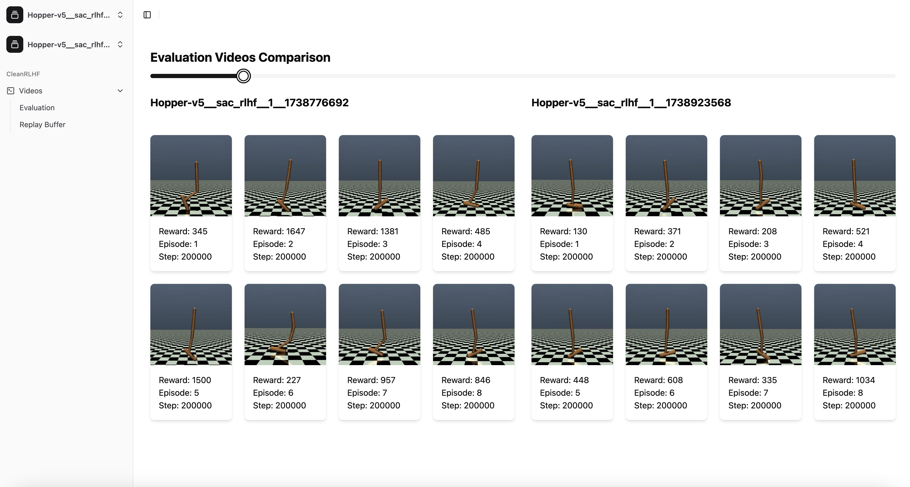

<br/>
<div style="display: flex; justify-content: center; align-items: center;">
  <div style="text-align: center; width: 25%">
    Swimmer<br/>
    <br>
    
  </div>
  <div style="text-align: center; width: 25%">
    Raise one leg<br>
    <br>
    <br>
  </div>
  <div style="text-align: center; width: 25%">
   Hopper<br>
    <br>
    <br>
  </div>
  <div style="text-align: center; width: 25%">
   Cheetah<br>
    <br>
    <br>
  </div>
</div>

<div style="display: flex; justify-content: center; align-items: center;">
  <div style="text-align: center; width: 50%">
    <br>
    Windmill (Clockwise)<br/>
    <br>
  </div>
  <div style="text-align: center; width: 50%">
    <br>
    Ant (Raise one leg)<br/>
    <br>
  </div>
</div>

# CleanRLHF

[](https://www.python.org)

[](https://pytorch.org)
[](https://github.com/psf/black)


A framework for Reinforcement Learning from Human Feedback.


* [Introduction](#-introduction)
* [Performance](#-performance)
* [Getting Started](#-getting-started)
  * [Prerequisites](#prerequisites)
  * [Installing the Dependencies](#installing-the-dependencies)
* [Usage](#-usage)
  * [Basic Code Execution](#basic-code-execution)
  * [Human Feedback](#human-feedback)
* [Features](#-features)
  * [Unsupervised Exploration](#unsupervised-exploration)
  * [Trajectory Sampling](#trajectory-sampling)
  * [Trajectory Scheduling](#trajectory-scheduling)
  * [SURF](#surf)
  * [RUNE](#rune)
  * [Video Recording & Rendering](#video-recording--rendering)
  * [Model Saving/Loading](#model-savingloading)
  * [Evaluation](#evaluation)
  * [Tracking](#tracking)
  * [Hyperparameter Tuning](#hyperparameter-tuning)
  * [Environments](#environments)
  * [Toolbox](#toolbox)


## 👋 Introduction

This framework implements RLHF and is oriented towards [PEBBLE](https://arxiv.org/abs/2106.05091). It is based on [SAC](https://arxiv.org/abs/1801.01290), an off-policy actor-critic algorithm for deep RL.

There also exists an implementation of [PrefPPO](https://arxiv.org/abs/1706.03741), which is a faster but less efficient approach to RLHF. Additionally to the implementations of these two papers, several features have been added, which are aimed at improving the performance as well as the user experience of our program. The features are [discussed](#-performance) and [documented](#-features) below.


## 🚀 Performance
<!--TODO-->
(WIP)


## 💡 Getting Started

### Prerequisites

Ensure the following are installed on your system:

* [poetry](https://python-poetry.org/docs/#installation)
* Python 3.10+
* xvfb (`sudo apt install xvfb` on Debian-based systems)
* ffmpeg (`sudo apt install ffmpeg` on Debian-based systems)

If you want to contribute, consider installing:
* [pre-commit](https://pre-commit.com/#install)

### Installing the Dependencies

1. Clone this repository and cd into it:

```bash
git clone https://github.com/jualat/CleanRLHF.git
cd CleanRLHF
```

2. Execute this command to install all dependencies automatically:

```bash
poetry install
```


## 🎯 Usage

### Basic Code Execution

To run the code, execute the following command from the `framework` directory, replacing Hopper-v5 with the desired environment ID (for an overview of all available environments, see [Environments](#environments)):

```bash
poetry run python3 sac_rlhf.py --env-id Hopper-v5
```

Use the xvfb-run command to execute the script in a headless Linux environment:

```bash
xvfb-run -- python3 sac_rlhf.py --env-id Hopper-v5
```

Setting the right hyperparameters is crucial for performance. Consider looking at our methods for [hyperparameter tuning](#hyperparameter-tuning) and/or check whether there exists a script `scripts/[ENV_ID].sh` with the hyperparameters that we found to work best for a specific environment.

### Human Feedback


To enable human feedback (instead of simulated feedback), use the `--teacher-feedback-mode` flag:

```bash
poetry run python3 sac_rlhf.py --teacher-feedback-mode human
```

Use the `--feedback-server-autostart` flag to automatically start the feedback server on http://localhost:5001/. You can additionally configure the address of the server:

```bash
poetry run python3 sac_rlhf.py --feedback-server-url remoteurl:1234
```

You can also manually start the feedback server by running the following command from the top directory of this repo:

```bash
python3 humanFeedback/feedback_server.py
```


## ✈️ Features

For a full list of available command-line arguments, take a look at `sac_rlhf.py` or run:
```bash
poetry run python3 sac_rlhf.py -h
```

### Unsupervised Exploration

At the beginning of a RLHF run, the models are initialized randomly and thus might not explore states sufficiently. Since informative queries are essential for the training's success, this is a major challenge. [Lee et al.](https://arxiv.org/abs/2106.05091) handle this issue using the environment's state entropy as an intrinsic reward in unsupervised pre-exploration.

Unsupervised pre-training is enabled by default and can be disabled with the `--no-unsupervised-exploration` flag.

It suffices to do pre-exploration only once per environment on your machine, for details see [Model Saving/Loading](#model-savingloading).

### Trajectory Sampling

Every trajectory that the agent produces during the training is saved in the replay buffer. Sampling random pairs of such trajectories for consultation of the human expert is inefficient. [Lee et al.](https://arxiv.org/abs/2106.05091) propose two methods for more profitable trajectory sampling. Note that the methods utilize ensemble reward models, a technique for improving training stability.

* **Disagree**: If, given a pair of trajectories, the models are not sure which one to prefer (i.e. the standard deviation of the preferences given by the members of the ensemble is high), then it is efficient to ask the human expert.
* **Entropy**: If a pair of trajectories is near the decision boundary (i.e. the entropy of the preferences given by the members of the ensemble is high), then we prefer to consult the human teacher for this pair.

By default, disagreement sampling is used. It can be set using the `--preference-sampling` flag, must be 'uniform', 'disagree', or 'entropy'.

### Trajectory Scheduling

Because of the low knowledge of the models at the beginning of the training, it can make sense to consult the human expert more often in earlier phases of the training.

Scheduling must be either 'linear' or 'exponential' and is set to be the latter by default. It can be adjusted with the `--teacher-feedback-schedule` flag.

### SURF

Collecting human feedback on a scale is pretty costly. An idea proposed by [Park et al.](https://arxiv.org/abs/2203.10050) is to use data augmentation to extract the highest possible amount of information from human labels. Specifically, SURF utilizes pseudo-labeling and temporal cropping for its purposes.

SURF is enabled by default and can be disabled with the `--no-surf` flag.

Feature-specific optional arguments:

| Argument | Description | Default | Type |
| -------- | ----------- | ------- | ---- |
| `--unlabeled-batch-ratio` | Ratio between the sizes of teacher-labeled and pseudo-labeled batches | `1` | `int` |
| `--surf-sampling-strategy` | Trajectory sampling strategy for SURF's pseudo-labeling (cf. [Trajectory Sampling](#trajectory-sampling)) | `uniform` | `str` |
| `--surf-tau` | Confidence threshold of the preference-predictor for pseudo-labeling | `0.999` | `float` |
| `--lambda-ssl` | Weight of the pseudo-labeled loss in the reward-net optimization | `0.1` | `float` |
| `--max-augmentation-offset` | Maximum length offset of pseudo-labeled pairs of cropped trajectories | `10` | `int` |
| `--min-augmentation-offset` | Minimum length offset of pseudo-labeled pairs of cropped trajectories | `5` | `int` |

### RUNE

The exploration/exploitation trade-off is a problem central to RL. [Liang et al.](https://arxiv.org/abs/2205.12401) present an intrinsic reward to encourage exploration.

RUNE is disabled by default and can be enabled with the `--rune` flag.

Feature-specific optional arguments:

| Argument | Description | Default | Type |
| -------- | ----------- | ------- | ---- |
| `--rune-beta` | Weight of the intrinsic reward being added to the total reward | `0.05` | `float` |
| `--rune-beta-decay` | Decay of the above-mentioned value during the training | `0.0001` | `float` |

### Video Recording & Rendering

Use the `--capture-video` flag to record a video of the agent's performance as well as rendering 
the selected trajectories for human preference:

```bash
poetry run python3 sac_rlhf.py --capture-video
```

To see the training's progress live, use the `--render-mode` flag with the `human` argument as follows:

```bash
poetry run python3 sac_rlhf.py --render-mode human
```

Note: Only either one of the above options can be used in a run.

### Model Saving/Loading

<!--TODO-->
(Remove if deprecated)

Once you have done unsupervised pre-exploration, the replay buffer and the model are automatically saved in `./models/[RUN]/[EXPLORATION_STEPS]/`.
To save time, instead of exploring the same environment every time, you can now load both results, e.g.:

```bash
poetry run python3 sac_rlhf.py --exploration-load --path-to-replay-buffer models/myrun/10000/replay_buffer.pth --path-to-model models/myrun/10000/checkpoint.pth
```

Note that the states of both objects are also saved at the end of a run or on KeyBoardInterrupt.

### Evaluation

After training a model, you can evaluate it and generate videos of its behavior by running the following command:
```bash
poetry run python3 evaluation.py --path-to-model <PATH> --env-id <ENV_ID>
```

### Tracking

#### [Weights & Biases](https://wandb.ai/)

Use the `--track  --wandb-project-name <PROJECT_NAME> --wandb-entity <WANDB_ENTITY>` flag to activate tracking via Weights &
Biases:

```bash
wandb login
poetry run python3 sac_rlhf.py --track  --wandb-project-name <PROJECT_NAME> --wandb-entity <WANDB_ENTITY>
```

#### [Tensorboard](https://www.tensorflow.org/tensorboard)

Run the following command to start a local instance of TensorBoard:

```bash
tensorboard --logdir=runs
```

You can access the TensorBoard at http://localhost:6006/

### Hyperparameter Tuning

The `sweep.py` script automates hyperparameter optimization using Weights & Biases (W&B) Sweeps. 

#### How to Run a Sweep:
1. Specify the Hyperparameter Config:

   Place your sweep configuration in `sweep_config/<SWEEP_NAME>.yaml`.


2. Run the Sweep with W&B:

   ```bash
   poetry run python3 sweep.py --project-name <PROJECT_NAME> --entity <WANDB_ENTITY> --sweep-count <N_RUNS> --config-filename ./sweep_config/<SWEEP_NAME>.yaml --algorithm <ALGORITHM>
   ```

   Arguments:

   | Argument | Description |
   | -------- | ----------- |
   | `--sweep-count` | Number of runs to launch in this session. |
   | `--project-name` | The name of your W&B project. |
   | `--entity` | Your W&B entity (team or username). |
   | `--algorithm` | Algorithm to run, must be 'sac-rlhf' (default), 'pref-ppo,' 'sac,' or 'ppo' |


3. Run the Sweep with Sweep ID:

   ```bash
   poetry run python3 sweep.py --project-name --sweep_id <SWEEP_ID> --sweep_count 3 --algorithm <ALGORITHM>
   ```

   Arguments:

   | Argument | Description |
   | -------- | ----------- |
   | `--sweep_id` | You can find this ID on the W&B dashboard. |
   | `--algorithm` | Algorithm to run, must be 'sac-rlhf' (default), 'pref-ppo,' 'sac,' or 'ppo' |

#### How to Run a Sweep on SLURM:

1. Setup a virtual environment and install the dependencies:

   > Note: This step is only required once. It'll install Miniconda, installs Python3.10, creates a virtual environment
   > and executes the `poetry install` command.
   > It also clones the CleanRLHF repository into ~/workspace directory

   ```bash
   cd slurm
   sh setup_venv.sh
   ```

2. Adjust `slurm/wandb_sweep.sbatch` to your needs:

   Make sure to replace the email to receive notifications and update absolute paths.

   ```
   #SBATCH --mail-user=yourname@campus.lmu.de
   #SBATCH --mail-type=ALL
   #SBATCH --chdir=/home/k/user/workspace/cleanrlhf/framework
   #SBATCH --output=/home/k/user/workspace/cleanrlhf/framework/slurm/slurm.%j.%N.out
   #SBATCH --error=/home/k/user/workspace/cleanrlhf/framework/slurm/slurm.%j.%N.err
   ```

   Finally, replace the last line of the file with the startup command of your sweep.

3. Submit the job to the SLURM cluster:

   > Note: You'll be prompted to paste your WAND API key. You can find it on your W&B dashboard.

   ```bash
   sh start_job.sh
   ```
   
   The command returns a job ID. You can check the status of your job with `squeue -u <username>`.

### Environments

#### [Mujoco](https://gymnasium.farama.org/environments/mujoco/)

All Mujoco environments are supported.

#### [Deepmind Control Suite](https://github.com/google-deepmind/dm_control/blob/main/dm_control/suite/README.md)

Almost all environments from the Deepmind Control Suite are supported. For a full list, check out [dm_control_working_envs.txt](https://github.com/jualat/CleanRLHF/blob/main/framework/dm_control_working_envs.txt).

### Toolbox

In addition to the framework, we have created a toolbox to compare runs of the framework. The tool as well as its documentation can be found in the [⁠ toolbox ⁠](https://github.com/jualat/CleanRLHF/tree/main/toolbox#readme) subdirectory.


